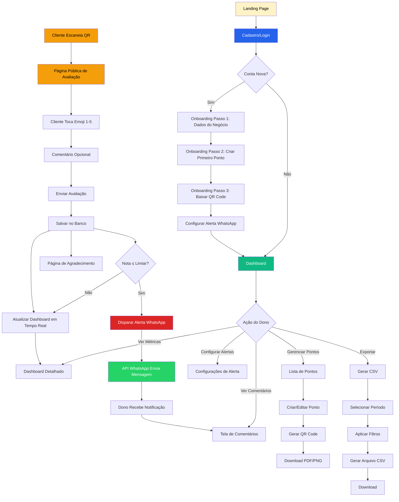
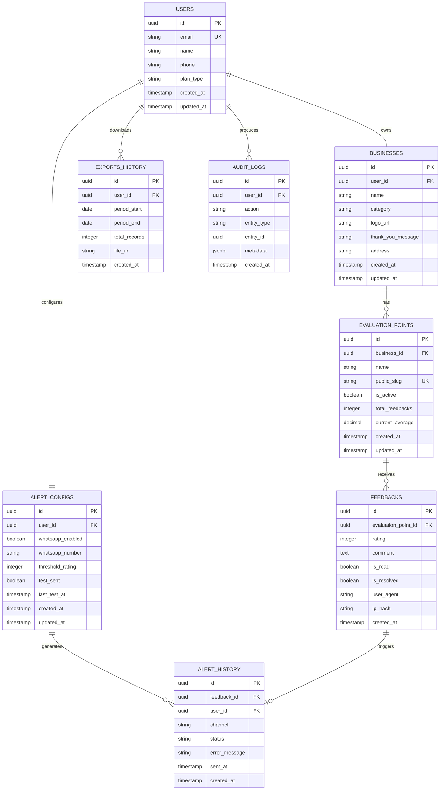
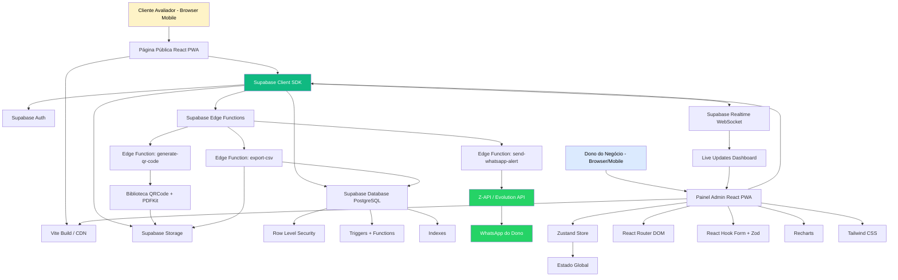

# PRD — Avalie o Meu Atendimento

## 1. Visão Geral

O **Avalie o Meu Atendimento** é um aplicativo web (PWA) que permite a pequenos negócios presenciais medirem a satisfação dos seus clientes de forma simples, rápida e sem qualquer fricção. A aplicação resolve uma dor crítica e silenciosa enfrentada por donos de lanchonetes, cafeterias, salões de beleza, petshops, farmácias de bairro, oficinas, academias e clínicas pequenas: **a impossibilidade de saber, com dados reais, se o atendimento está bom**. Esses gestores tomam decisões baseadas em intuição, percebem problemas só quando o cliente já não voltou e não possuem nem tempo nem conhecimento técnico para implementar sistemas complexos de CSAT, NPS ou pesquisas elaboradas. O Avalie o Meu Atendimento entrega um caminho radicalmente simples: o dono gera um QR Code, coloca no balcão, na mesa ou no caixa, e o cliente avalia o atendimento com **emojis de 1 a 5** em menos de 5 segundos, sem cadastro, sem login, sem fricção.

A solução funciona através de dois universos completamente separados e otimizados. De um lado, o **dono do negócio** acessa um painel onde cria sua conta, cadastra seu estabelecimento, gera QR Codes únicos para cada ponto de atendimento (balcão, mesa, recepção, caixa), acompanha um dashboard limpo com a média do mês, evolução semanal, comentários recentes e recebe alertas automáticos no WhatsApp sempre que uma nota baixa for registrada — assim ele consegue agir imediatamente para reverter uma experiência ruim antes que o cliente vá embora insatisfeito. Do outro lado, o **cliente avaliador** acessa uma página pública leve ao escanear o QR Code, toca em um dos cinco emojis (😡 😕 😐 🙂 😍), opcionalmente escreve um comentário curto, e o feedback é registrado instantaneamente. Toda a experiência foi desenhada para ser viável em um celular mediano, com 3G ruim, em um cliente que tem 10 segundos para opinar.

O **público-alvo primário** são donos e gestores de pequenos negócios presenciais: lanchonetes, cafeterias, mercadinhos, salões de beleza e barbearias, clínicas pequenas, petshops, farmácias de bairro, oficinas mecânicas, academias pequenas e restaurantes self-service. Trata-se de um perfil de baixo letramento técnico, sem equipe de TI, com pouco tempo no dia a dia, que precisa de uma ferramenta que funcione na primeira tentativa, sem treinamento, sem suporte. O **público secundário** são os clientes finais desses estabelecimentos, que serão os avaliadores — e para eles a única exigência é zero fricção: nenhum cadastro, nenhum login, nenhum formulário longo. Apenas um toque.

Os principais diferenciais do Avalie o Meu Atendimento são: **1. Simplicidade Radical**, do onboarding ao uso diário, projetado para quem nunca usou um SaaS; **2. Zero Fricção para o Cliente Final**, com avaliação anônima em até 5 segundos via emoji; **3. Alertas Acionáveis via WhatsApp**, levando a informação para o canal onde o dono já está, sem exigir que ele entre em um app para descobrir um problema; **4. Dashboard "Para Leigos"**, com linguagem visual, sem jargão de CX/NPS, focado em "está bom ou está ruim?"; e **5. Gratuito no MVP**, removendo qualquer barreira de entrada e permitindo validação real com os primeiros 100 negócios ativos.

---

## 2. Funcionalidades

### 2.1 Perfis de Usuário

| Perfil | Registro | Permissões | Acessos Principais |
|---|---|---|---|
| **Dono do Negócio (Admin)** | E-mail e senha, ou login social (Google), via Supabase Auth. | Controle total sobre seu próprio negócio: criar/editar pontos, gerar QR Codes, ver feedbacks, configurar alertas, exportar dados. | Dashboard, Gestão de Pontos de Avaliação, Configuração de Alertas WhatsApp, Comentários, Exportação CSV, Configurações da Conta. |
| **Funcionário/Gerente (Visualizador)** *(fase 2)* | Convite por e-mail enviado pelo Dono. | Apenas visualização do dashboard e dos comentários. Não pode criar pontos, alterar configurações ou exportar dados. | Dashboard (somente leitura), Comentários (somente leitura). |
| **Cliente Avaliador (Anônimo)** | **Nenhum registro.** Acesso via QR Code apenas. | Apenas enviar uma avaliação (emoji + comentário opcional) para o ponto específico do QR Code escaneado. | Página pública de avaliação, Página de agradecimento pós-envio. |

### 2.2 Módulos do Sistema

1. **Módulo de Autenticação** — Cadastro e login do dono via e-mail/senha e Google OAuth (Supabase Auth). Inclui recuperação de senha, confirmação de e-mail e logout. Sessão persistente para reduzir atrito no acesso recorrente.
2. **Módulo de Onboarding** — Fluxo guiado de 3 passos após o primeiro login: (1) nome do negócio e categoria, (2) criação do primeiro ponto de avaliação, (3) download/impressão do primeiro QR Code. Objetivo: o dono sair com QR Code na mão em menos de 2 minutos.
3. **Gestão de Negócio** — Cadastro do estabelecimento com nome, categoria (lanchonete, salão, petshop etc.), endereço opcional, logo e WhatsApp do dono para alertas. Limitado a 1 negócio por conta no MVP.
4. **Gestão de Pontos de Avaliação** — Criação, edição, ativação/desativação e exclusão de "pontos" (ex: Mesa 1, Balcão, Caixa, Recepção). Cada ponto possui um QR Code único e URL pública. No MVP gratuito, **1 ponto por conta**; após validação, planos pagos liberam múltiplos pontos.
5. **Gerador de QR Code** — Geração automática e instantânea do QR Code em alta resolução (PNG/SVG) para cada ponto, com opção de download e versão para impressão A6 já com instrução visual ("Avalie nosso atendimento").
6. **Coleta Pública de Feedback** — Página pública e ultraleve, sem login, otimizada para mobile. Exibe os 5 emojis de avaliação (1 a 5), campo opcional de comentário e botão de envio. Funciona offline-first com fila de envio se houver perda de conexão.
7. **Dashboard de Métricas** — Visão consolidada com: nota média geral, nota média do dia/semana/mês, distribuição das avaliações (gráfico de barras por nota), evolução temporal (gráfico de linha) e últimos comentários. Atualização em tempo real via Supabase Realtime.
8. **Sistema de Comentários** — Listagem cronológica dos comentários recebidos, com filtro por nota, período e ponto de avaliação. Marcação manual de "lido" e "resolvido" para acompanhamento.
9. **Sistema de Alertas WhatsApp** — Envio automático de mensagem via WhatsApp Business API (Z-API/Twilio/Evolution API) para o número do dono sempre que uma avaliação ≤ 2 for registrada. Inclui o ponto, a nota e o comentário (se houver).
10. **Exportação de Dados** — Geração de arquivo CSV com todas as avaliações filtradas pelo período selecionado. Inclui data/hora, ponto, nota, comentário.
11. **Configurações da Conta** — Edição do nome, e-mail, senha, WhatsApp para alertas, ativar/desativar alertas, limiar de alerta (nota ≤ 2 por padrão, configurável).
12. **Página de Agradecimento Pós-Avaliação** — Tela final exibida ao cliente após o envio, com mensagem personalizável pelo dono ("Obrigado! Volte sempre 💛").

### 2.3 Páginas Principais

| Página | Módulo | Descrição | Elementos-Chave da Interface |
|---|---|---|---|
| **Landing Page Pública** | Marketing | Página única explicando o produto, com CTA "Criar conta grátis". | Hero com mockup do app, 3 cards "como funciona", FAQ, depoimentos, botão WhatsApp para dúvidas. |
| **Login / Cadastro** | Autenticação | Tela única para login e criação de conta. | Campos e-mail e senha, botão "Entrar com Google", links "Criar conta" e "Esqueci senha". |
| **Onboarding (Wizard 3 Passos)** | Onboarding | Fluxo guiado pós-primeiro login. | Passo 1: nome do negócio + categoria. Passo 2: nome do primeiro ponto. Passo 3: download do QR Code com tutorial visual. |
| **Dashboard Principal** | Dashboard | Tela inicial do dono após login. Visão macro da satisfação. | Card grande "Média Geral", cards de média do dia/semana/mês, gráfico de barras (distribuição 1–5), gráfico de linha (evolução 30 dias), lista dos 5 últimos comentários, badge de alertas não lidos. |
| **Meus Pontos de Avaliação** | Gestão de Pontos | Lista dos pontos cadastrados com seus QR Codes. | Cards de cada ponto (nome, status ativo/inativo, total de avaliações, média), botão "Novo Ponto" (bloqueado no plano gratuito após o 1º), ações: Ver QR, Editar, Pausar, Excluir. |
| **Detalhe do Ponto / QR Code** | Gestão de Pontos | Tela do ponto específico com QR Code grande, instruções e estatísticas isoladas. | QR Code grande (download PNG/SVG/PDF A6), URL pública copiável, métricas do ponto, botão "Imprimir versão pronta". |
| **Página Pública de Avaliação** | Coleta de Feedback | URL acessada via QR Code. **Sem login.** Mobile-first. | Logo + nome do negócio, pergunta "Como foi seu atendimento?", 5 emojis grandes em linha (😡 😕 😐 🙂 😍), textarea opcional "Quer nos contar mais?", botão "Enviar avaliação". |
| **Página de Agradecimento** | Coleta de Feedback | Exibida após envio do feedback. | Mensagem de agradecimento, emoji animado, mensagem personalizada do dono, botão "Voltar" (opcional). |
| **Comentários** | Comentários | Listagem completa de feedbacks recebidos. | Filtros (nota, período, ponto), barra de busca por palavra, lista cronológica com nota colorida + comentário + data/hora, marcador "lido/resolvido". |
| **Configurações de Alertas** | Alertas | Configura quando e como receber notificações. | Toggle "Ativar alertas WhatsApp", input do número WhatsApp, slider "Receber alertas para notas até X estrelas" (padrão: 2), botão "Enviar mensagem de teste". |
| **Exportar Dados** | Exportação | Geração de CSV. | Seletor de período (date range), filtro por ponto, botão "Baixar CSV", histórico de últimas exportações. |
| **Minha Conta** | Configurações | Dados pessoais e do negócio. | Edição de nome, e-mail, senha, logo do negócio, mensagem de agradecimento personalizada, botão "Excluir conta". |

---

## 3. Processos de Navegação e Fluxo

### Dono do Negócio — Primeiro Uso

1. **Descoberta:** chega à landing page via indicação, anúncio ou busca orgânica.
2. **Cadastro:** clica em "Criar conta grátis", cadastra-se com e-mail/senha ou Google.
3. **Onboarding (Passo 1):** informa nome do negócio e categoria (ex: "Café da Esquina", Cafeteria).
4. **Onboarding (Passo 2):** cria o primeiro ponto de avaliação (ex: "Balcão").
5. **Onboarding (Passo 3):** visualiza o QR Code gerado, baixa em PDF A6 já formatado para impressão, recebe instruções visuais de onde colar.
6. **Primeira Configuração:** acessa "Configurações de Alertas", insere número de WhatsApp, envia mensagem de teste e confirma recebimento.
7. **Operação:** imprime o QR e cola no balcão.
8. **Acompanhamento Diário:** abre o app no celular 1–2 vezes ao dia para ver o dashboard. Quando recebe alerta no WhatsApp, abre direto a tela de comentários para entender o problema.

### Cliente Avaliador — Fluxo Único

1. **Escaneamento:** está no estabelecimento, vê o QR Code no balcão/mesa, abre a câmera do celular e aponta.
2. **Acesso:** o navegador abre a URL pública do ponto específico (sem necessidade de instalar app).
3. **Avaliação:** vê uma pergunta curta e 5 emojis grandes. Toca em um (decisão de 2–3 segundos).
4. **Comentário Opcional:** o campo de texto aparece após o toque no emoji. Pode pular ou escrever uma frase curta.
5. **Envio:** toca em "Enviar avaliação". A submissão é instantânea.
6. **Confirmação:** vê a tela de agradecimento com mensagem do dono. Fecha o navegador. **Não cria conta, não deixa rastro pessoal.**

### Dono do Negócio — Resposta a Alerta

1. **Notificação:** recebe no WhatsApp: "⚠️ Avaliação 2★ recebida no Balcão. Comentário: 'Atendente foi grosso'. Horário: 14:32. Veja agora: [link]".
2. **Acesso Rápido:** clica no link, é autenticado automaticamente (deeplink) e cai direto na tela de Comentários.
3. **Análise:** lê o feedback completo, cruza com o horário para identificar qual funcionário estava no turno.
4. **Ação:** conversa com a equipe, marca o comentário como "resolvido" no app.
5. **Acompanhamento:** monitora se notas baixas se repetem nos próximos dias para validar se a ação resolveu o problema.

### Funcionário/Gerente (Fase 2)

1. **Convite:** recebe e-mail do dono com link de acesso.
2. **Cadastro Limitado:** define apenas senha (e-mail já vem preenchido).
3. **Acesso ao Dashboard:** vê as métricas e comentários, mas sem permissão para alterar configurações, criar pontos ou exportar dados.

---

## 4. Diagrama de Fluxo Completo



---

## 5. Design Interface

### 5.1 Estilo Visual

**Princípios Visuais:**
- **Simples acima de bonito:** clareza, hierarquia óbvia, zero ambiguidade.
- **Humano e acolhedor:** linguagem coloquial, cores quentes, emojis grandes.
- **Performático em conexão ruim:** componentes leves, fontes do sistema como fallback.
- **Touch-first:** áreas de toque ≥ 56px, especialmente na página pública.

**Sistema de Cores:**

```
PRIMÁRIAS:
- #F59E0B (Amarelo-laranja) — Brand principal, CTAs, emojis selecionados
- #D97706 (Laranja escuro) — Hover, estados ativos
- #FEF3C7 (Amarelo claro) — Backgrounds, highlights

SEMÂNTICAS (notas):
- #DC2626 (Vermelho) — Nota 1 😡
- #F97316 (Laranja) — Nota 2 😕
- #EAB308 (Amarelo) — Nota 3 😐
- #84CC16 (Verde-lima) — Nota 4 🙂
- #16A34A (Verde) — Nota 5 😍

NEUTROS:
- #0F172A (Slate-900) — Texto principal
- #475569 (Slate-600) — Texto secundário
- #94A3B8 (Slate-400) — Placeholders, ícones
- #E2E8F0 (Slate-200) — Bordas, divisores
- #F8FAFC (Slate-50) — Background cards
- #FFFFFF — Background principal

UTILITÁRIAS:
- #25D366 (Verde WhatsApp) — Botões e badges relacionados ao WhatsApp
- #DC2626 (Vermelho) — Alertas, ações destrutivas
```

**Sistema Tipográfico:**

```
FONTE: Inter (Google Fonts), fallback: -apple-system, sans-serif
PESOS: 400, 500, 600, 700

HIERARQUIA:
- H1 (Dashboard title): 28px / 1.2 / 700
- H2 (Section): 22px / 1.3 / 600
- H3 (Card title): 18px / 1.4 / 600
- Body Large: 17px / 1.6 / 400 — usado na página pública (legibilidade no celular)
- Body: 15px / 1.5 / 400
- Caption: 13px / 1.4 / 500
- Button: 16px / 1 / 600

ESPECIAIS:
- Nota Média (display): 56px / 1 / 700 — número grande no dashboard
- Emoji (página pública): 56px — área clicável de 72×72px
```

**Sistema de Componentes:**

```
BOTÕES:
- Primary: bg-#F59E0B, hover:#D97706, altura 48px, radius 12px, peso 600
- Secondary: border-2 #F59E0B, texto #D97706, altura 48px
- WhatsApp: bg-#25D366, ícone WhatsApp à esquerda
- Destructive: bg-#DC2626, hover:#B91C1C
- Tamanhos: SM (40px), MD (48px - padrão), LG (56px - mobile critical)

CARDS:
- Background: #FFFFFF
- Border: 1px solid #E2E8F0
- Radius: 16px
- Padding: 20px
- Shadow: 0 1px 3px rgba(0,0,0,0.05)
- Hover: shadow-md, lift -2px

INPUTS:
- Altura: 48px (mínimo touch target)
- Border: 1px #CBD5E1, focus: 2px #F59E0B
- Radius: 10px
- Padding: 0 14px
- Font: 16px (evita zoom automático no iOS)

EMOJIS DE AVALIAÇÃO (página pública):
- Tamanho: 56–64px
- Espaçamento: 12px entre eles
- Estado selecionado: scale(1.2), border-3 da cor semântica
- Animação: spring/bounce ao tocar (200ms)

QR CODE DISPLAY:
- Tamanho: 320×320px em tela, 600×600px em PDF
- Border: 16px branco em volta
- Logo central opcional (24px)

NAVEGAÇÃO:
- Mobile (padrão): Bottom tab bar 64px, 4 ícones (Dashboard, Pontos, Comentários, Conta)
- Desktop: Sidebar 240px, mesma estrutura
- Header: 56px com logo + nome do negócio + ícone de notificação
```

### 5.2 Tabela de Páginas Detalhada

| Página | UI Principal | Componentes Críticos | Interações & Micro-interações |
|---|---|---|---|
| **Landing Page** | Hero + 3 steps + FAQ | Mockup animado do QR, CTAs duplicados (topo e fim), seção depoimentos | Scroll suave, animação fade-in nas seções, botão flutuante WhatsApp |
| **Login/Cadastro** | Form centralizado, card único | Tabs "Entrar/Criar conta", botão Google OAuth, link recuperar senha | Validação inline, loader no botão, transição suave entre tabs |
| **Onboarding** | Wizard 3 passos, progress bar topo | Progress dots, ilustração por passo, botão "Próximo" sempre visível | Animação slide entre passos, confete ao final, vibração no celular ao baixar QR |
| **Dashboard** | Grid responsivo de cards, hero com nota média | Card hero "Média Geral", mini cards de período, gráfico Recharts, lista de comentários | Counter animation na nota, hover nos gráficos com tooltip, pull-to-refresh no mobile, badge pulsante para novos alertas |
| **Meus Pontos** | Lista de cards verticais | Card por ponto com mini-stats, botão FAB "+ Novo Ponto", estado vazio amigável | Long-press para opções rápidas, swipe para arquivar (mobile), tooltip "Plano grátis limitado a 1 ponto" |
| **Detalhe do Ponto** | QR Code grande centralizado | QR Code, botões de download (PNG/SVG/PDF), preview de impressão, métricas isoladas | Animação ao gerar QR, copy-to-clipboard com toast de confirmação, modal de impressão |
| **Página Pública** | Single column, full-screen mobile | Logo + nome topo, pergunta gigante, 5 emojis em linha, textarea, botão grande inferior | Tap no emoji: bounce + scale, abertura suave do textarea, botão muda de cinza para amarelo após seleção, loader no envio, confete na confirmação |
| **Página de Agradecimento** | Tela inteira limpa, ilustração central | Mensagem personalizada do dono, emoji animado, contador de "1.234 clientes já avaliaram" | Animação celebratória (heart/star particles), auto-close em 8s ou tap |
| **Comentários** | Lista cronológica filtrável | Filtros chips no topo, cards de comentário com nota colorida lateral, estado vazio | Swipe-right para marcar como lido, modal de detalhe ao tocar, infinite scroll |
| **Configurações de Alerta** | Form vertical simples | Toggle grande no topo, input WhatsApp com máscara BR, slider visual de limiar, botão teste | Toggle com transição smooth, slider com feedback haptico, toast verde após teste enviado |
| **Exportar Dados** | Form + histórico | Date range picker, dropdown de pontos, botão download grande, lista de exports anteriores | Loader durante geração, download direto no browser, toast "CSV gerado" |
| **Minha Conta** | Form vertical com seções | Avatar upload, campos editáveis, área "perigo" colapsável (excluir conta) | Auto-save com debounce, badge "salvo" temporário, confirmação dupla para deletar conta |

### 5.3 Responsividade

**MOBILE (320–767px) — Experiência Primária**

A maioria dos donos vai usar o app no próprio celular durante o expediente. A página pública de avaliação é **100% mobile-first** porque é onde 99% dos clientes vão acessar.

```
Layout:
- Single column, padding lateral 16px
- Bottom navigation 64px com 4 ícones
- Header sticky 56px
- Cards full-width (sem grid)
- Form em coluna única
- Botões full-width na maioria dos casos

Página Pública:
- Pergunta centralizada: 24px/600
- 5 emojis: 56–64px cada, espaço 12px entre, layout em linha horizontal
- Textarea: max 120px altura inicial, expansível
- Botão envio: full-width, 56px altura, sticky bottom

Touch Targets:
- Mínimo 48×48px em todos elementos clicáveis
- 56×56px na página pública (criticidade da experiência)
- Safe area inset para iPhones com notch
```

**TABLET (768–1199px) — Experiência de Caixa**

Muitos estabelecimentos vão deixar um tablet fixo no balcão exibindo a página de avaliação. Esse cenário precisa ser otimizado.

```
Layout:
- Grid 8 colunas, gutter 16px
- Sidebar collapsada (apenas ícones, 72px)
- Cards em grid 2 colunas no dashboard
- Forms em 2 colunas quando aplicável

Página Pública em Tablet (modo kiosk):
- Conteúdo centralizado max-width 600px
- Emojis ainda maiores: 80px
- Auto-reset após 15s na tela de agradecimento (volta para tela de avaliação)
```

**DESKTOP (≥1200px) — Experiência de Gestão**

```
Layout:
- Grid 12 colunas, gutter 24px
- Sidebar fixa 240px
- Main content max-width 1200px
- Dashboard em grid 3 colunas
- Tooltips em hover (300ms delay)
- Atalhos de teclado (ex: G+D para ir ao Dashboard)
```

**Estados Especiais:**

- **Offline:** página pública guarda submissão em IndexedDB e tenta reenviar quando conexão volta (importante porque WiFi de estabelecimentos é frequentemente instável).
- **Conexão lenta (3G):** lazy load de gráficos no dashboard, página pública abaixo de 50KB.
- **Modo escuro:** suportado no dashboard do dono (preferência do sistema), **NÃO** na página pública (sempre clara para máxima legibilidade).
- **Acessibilidade:** WCAG AA, contraste mínimo 4.5:1, navegação por teclado completa, ARIA labels em emojis ("Muito ruim", "Ruim", "Regular", "Bom", "Excelente").

---

## 6. Modelo de Dados

### 6.1 Diagrama ER



### 6.2 SQL — Schema Completo

```sql
-- ============================================
-- TABELA: users (donos dos negócios)
-- ============================================
CREATE TABLE users (
    id UUID DEFAULT gen_random_uuid() PRIMARY KEY,
    email VARCHAR(255) UNIQUE NOT NULL,
    name VARCHAR(150) NOT NULL,
    phone VARCHAR(20),
    plan_type VARCHAR(30) NOT NULL DEFAULT 'free',
    created_at TIMESTAMP WITH TIME ZONE DEFAULT NOW(),
    updated_at TIMESTAMP WITH TIME ZONE DEFAULT NOW()
);

CREATE INDEX idx_users_email ON users(email);
ALTER TABLE users ENABLE ROW LEVEL SECURITY;

CREATE POLICY "Users can view own data" ON users
    FOR SELECT USING (auth.uid() = id);

CREATE POLICY "Users can update own data" ON users
    FOR UPDATE USING (auth.uid() = id);

-- ============================================
-- TABELA: businesses (1 por usuário no MVP)
-- ============================================
CREATE TABLE businesses (
    id UUID DEFAULT gen_random_uuid() PRIMARY KEY,
    user_id UUID UNIQUE NOT NULL REFERENCES users(id) ON DELETE CASCADE,
    name VARCHAR(150) NOT NULL,
    category VARCHAR(50) NOT NULL,
    logo_url TEXT,
    thank_you_message TEXT DEFAULT 'Obrigado pela sua avaliação! Volte sempre 💛',
    address TEXT,
    created_at TIMESTAMP WITH TIME ZONE DEFAULT NOW(),
    updated_at TIMESTAMP WITH TIME ZONE DEFAULT NOW()
);

CREATE INDEX idx_businesses_user ON businesses(user_id);
ALTER TABLE businesses ENABLE ROW LEVEL SECURITY;

CREATE POLICY "Users manage own business" ON businesses
    FOR ALL USING (auth.uid() = user_id);

-- ============================================
-- TABELA: evaluation_points (pontos de QR)
-- ============================================
CREATE TABLE evaluation_points (
    id UUID DEFAULT gen_random_uuid() PRIMARY KEY,
    business_id UUID NOT NULL REFERENCES businesses(id) ON DELETE CASCADE,
    name VARCHAR(100) NOT NULL,
    public_slug VARCHAR(20) UNIQUE NOT NULL,
    is_active BOOLEAN DEFAULT true,
    total_feedbacks INTEGER DEFAULT 0,
    current_average DECIMAL(3,2) DEFAULT 0.00,
    created_at TIMESTAMP WITH TIME ZONE DEFAULT NOW(),
    updated_at TIMESTAMP WITH TIME ZONE DEFAULT NOW()
);

CREATE INDEX idx_eval_points_business ON evaluation_points(business_id);
CREATE INDEX idx_eval_points_slug ON evaluation_points(public_slug);
CREATE INDEX idx_eval_points_active ON evaluation_points(is_active) WHERE is_active = true;
ALTER TABLE evaluation_points ENABLE ROW LEVEL SECURITY;

CREATE POLICY "Users manage own points" ON evaluation_points
    FOR ALL USING (
        business_id IN (SELECT id FROM businesses WHERE user_id = auth.uid())
    );

CREATE POLICY "Public can read active points by slug" ON evaluation_points
    FOR SELECT USING (is_active = true);

-- ============================================
-- TABELA: feedbacks (avaliações anônimas)
-- ============================================
CREATE TABLE feedbacks (
    id UUID DEFAULT gen_random_uuid() PRIMARY KEY,
    evaluation_point_id UUID NOT NULL REFERENCES evaluation_points(id) ON DELETE CASCADE,
    rating INTEGER NOT NULL CHECK (rating BETWEEN 1 AND 5),
    comment TEXT,
    is_read BOOLEAN DEFAULT false,
    is_resolved BOOLEAN DEFAULT false,
    user_agent TEXT,
    ip_hash VARCHAR(64),
    created_at TIMESTAMP WITH TIME ZONE DEFAULT NOW()
);

CREATE INDEX idx_feedbacks_point ON feedbacks(evaluation_point_id);
CREATE INDEX idx_feedbacks_created ON feedbacks(created_at DESC);
CREATE INDEX idx_feedbacks_rating ON feedbacks(rating);
CREATE INDEX idx_feedbacks_unread ON feedbacks(is_read) WHERE is_read = false;
ALTER TABLE feedbacks ENABLE ROW LEVEL SECURITY;

CREATE POLICY "Owners read own feedbacks" ON feedbacks
    FOR SELECT USING (
        evaluation_point_id IN (
            SELECT ep.id FROM evaluation_points ep
            JOIN businesses b ON ep.business_id = b.id
            WHERE b.user_id = auth.uid()
        )
    );

CREATE POLICY "Anyone can insert feedback (anonymous)" ON feedbacks
    FOR INSERT WITH CHECK (
        evaluation_point_id IN (
            SELECT id FROM evaluation_points WHERE is_active = true
        )
    );

-- ============================================
-- TABELA: alert_configs
-- ============================================
CREATE TABLE alert_configs (
    id UUID DEFAULT gen_random_uuid() PRIMARY KEY,
    user_id UUID UNIQUE NOT NULL REFERENCES users(id) ON DELETE CASCADE,
    whatsapp_enabled BOOLEAN DEFAULT false,
    whatsapp_number VARCHAR(20),
    threshold_rating INTEGER DEFAULT 2 CHECK (threshold_rating BETWEEN 1 AND 5),
    test_sent BOOLEAN DEFAULT false,
    last_test_at TIMESTAMP WITH TIME ZONE,
    created_at TIMESTAMP WITH TIME ZONE DEFAULT NOW(),
    updated_at TIMESTAMP WITH TIME ZONE DEFAULT NOW()
);

CREATE INDEX idx_alert_configs_user ON alert_configs(user_id);
ALTER TABLE alert_configs ENABLE ROW LEVEL SECURITY;

CREATE POLICY "Users manage own alert configs" ON alert_configs
    FOR ALL USING (auth.uid() = user_id);

-- ============================================
-- TABELA: alert_history
-- ============================================
CREATE TABLE alert_history (
    id UUID DEFAULT gen_random_uuid() PRIMARY KEY,
    feedback_id UUID NOT NULL REFERENCES feedbacks(id) ON DELETE CASCADE,
    user_id UUID NOT NULL REFERENCES users(id) ON DELETE CASCADE,
    channel VARCHAR(30) NOT NULL DEFAULT 'whatsapp',
    status VARCHAR(30) NOT NULL,
    error_message TEXT,
    sent_at TIMESTAMP WITH TIME ZONE,
    created_at TIMESTAMP WITH TIME ZONE DEFAULT NOW()
);

CREATE INDEX idx_alert_history_user ON alert_history(user_id);
CREATE INDEX idx_alert_history_feedback ON alert_history(feedback_id);
ALTER TABLE alert_history ENABLE ROW LEVEL SECURITY;

CREATE POLICY "Users view own alerts" ON alert_history
    FOR SELECT USING (auth.uid() = user_id);

-- ============================================
-- TABELA: exports_history
-- ============================================
CREATE TABLE exports_history (
    id UUID DEFAULT gen_random_uuid() PRIMARY KEY,
    user_id UUID NOT NULL REFERENCES users(id) ON DELETE CASCADE,
    period_start DATE NOT NULL,
    period_end DATE NOT NULL,
    total_records INTEGER DEFAULT 0,
    file_url TEXT,
    created_at TIMESTAMP WITH TIME ZONE DEFAULT NOW()
);

CREATE INDEX idx_exports_user ON exports_history(user_id);
ALTER TABLE exports_history ENABLE ROW LEVEL SECURITY;

CREATE POLICY "Users view own exports" ON exports_history
    FOR ALL USING (auth.uid() = user_id);

-- ============================================
-- TABELA: audit_logs
-- ============================================
CREATE TABLE audit_logs (
    id UUID DEFAULT gen_random_uuid() PRIMARY KEY,
    user_id UUID REFERENCES users(id) ON DELETE SET NULL,
    action VARCHAR(50) NOT NULL,
    entity_type VARCHAR(50) NOT NULL,
    entity_id UUID,
    metadata JSONB DEFAULT '{}',
    created_at TIMESTAMP WITH TIME ZONE DEFAULT NOW()
);

CREATE INDEX idx_audit_user ON audit_logs(user_id);
CREATE INDEX idx_audit_action ON audit_logs(action);
CREATE INDEX idx_audit_created ON audit_logs(created_at DESC);
ALTER TABLE audit_logs ENABLE ROW LEVEL SECURITY;

-- ============================================
-- TRIGGER: atualizar média e contagem do ponto
-- ============================================
CREATE OR REPLACE FUNCTION update_point_stats()
RETURNS TRIGGER AS $$
BEGIN
    UPDATE evaluation_points
    SET 
        total_feedbacks = (SELECT COUNT(*) FROM feedbacks WHERE evaluation_point_id = NEW.evaluation_point_id),
        current_average = (SELECT COALESCE(AVG(rating), 0) FROM feedbacks WHERE evaluation_point_id = NEW.evaluation_point_id),
        updated_at = NOW()
    WHERE id = NEW.evaluation_point_id;
    RETURN NEW;
END;
$$ LANGUAGE plpgsql;

CREATE TRIGGER trigger_update_point_stats
AFTER INSERT ON feedbacks
FOR EACH ROW EXECUTE FUNCTION update_point_stats();

-- ============================================
-- TRIGGER: enforce plano gratuito (1 ponto)
-- ============================================
CREATE OR REPLACE FUNCTION enforce_free_plan_limit()
RETURNS TRIGGER AS $$
DECLARE
    user_plan VARCHAR(30);
    point_count INTEGER;
BEGIN
    SELECT u.plan_type INTO user_plan
    FROM users u
    JOIN businesses b ON b.user_id = u.id
    WHERE b.id = NEW.business_id;
    
    IF user_plan = 'free' THEN
        SELECT COUNT(*) INTO point_count
        FROM evaluation_points
        WHERE business_id = NEW.business_id AND is_active = true;
        
        IF point_count >= 1 THEN
            RAISE EXCEPTION 'Plano gratuito permite apenas 1 ponto ativo. Faça upgrade para criar mais.';
        END IF;
    END IF;
    
    RETURN NEW;
END;
$$ LANGUAGE plpgsql;

CREATE TRIGGER trigger_enforce_free_plan
BEFORE INSERT ON evaluation_points
FOR EACH ROW EXECUTE FUNCTION enforce_free_plan_limit();

-- ============================================
-- FUNÇÃO: gerar slug público único
-- ============================================
CREATE OR REPLACE FUNCTION generate_public_slug()
RETURNS TRIGGER AS $$
BEGIN
    IF NEW.public_slug IS NULL OR NEW.public_slug = '' THEN
        NEW.public_slug := substr(md5(random()::text || clock_timestamp()::text), 1, 10);
    END IF;
    RETURN NEW;
END;
$$ LANGUAGE plpgsql;

CREATE TRIGGER trigger_generate_slug
BEFORE INSERT ON evaluation_points
FOR EACH ROW EXECUTE FUNCTION generate_public_slug();
```

---

## 7. Arquitetura

### 7.1 Diagrama de Arquitetura



### 7.2 Stack Tecnológica

**Frontend Core**
- **React 18** — biblioteca de UI com componentes funcionais e hooks
- **TypeScript 5** — tipagem estática end-to-end
- **Vite 5** — build tool moderno com HMR
- **PWA** (vite-plugin-pwa) — instalação no celular do dono, offline-ready para a página pública

**Estilização**
- **Tailwind CSS 3** — utility-first CSS
- **Headless UI** — componentes acessíveis sem estilo
- **Lucide React** — biblioteca de ícones SVG leves

**Backend (BaaS)**
- **Supabase** — plataforma completa:
  - **PostgreSQL 15** — banco de dados
  - **Supabase Auth** — autenticação (e-mail/senha + Google OAuth)
  - **Realtime** — WebSockets para dashboard ao vivo
  - **Storage** — armazenamento de QR Codes (PDF/PNG), logos, exports CSV
  - **Edge Functions** (Deno) — funções serverless para WhatsApp, QR Codes e exports

**Estado e Roteamento**
- **Zustand** — gerenciamento de estado global (leve, sem boilerplate)
- **React Router DOM 6** — roteamento SPA
- **TanStack Query (React Query)** — cache de dados do servidor, refetch automático

**Formulários e Validação**
- **React Hook Form** — formulários performáticos
- **Zod** — validação de schemas TypeScript-first

**Visualização e Funcionalidades Específicas**
- **Recharts** — gráficos do dashboard (barras, linhas)
- **qrcode** (npm) — geração de QR Codes
- **pdf-lib** — geração do PDF A6 para impressão
- **react-input-mask** — máscara de telefone BR
- **date-fns** — manipulação de datas (pt-BR)

**Integrações Externas**
- **Z-API** ou **Evolution API** — WhatsApp Business API (acessível para SMB no Brasil; alternativa: Twilio WhatsApp)
- **Resend** — e-mails transacionais (confirmação, recuperação de senha)
- **Sentry** — monitoramento de erros em produção
- **PostHog** — analytics de produto (funnel de onboarding, eventos chave)

### 7.3 Estrutura de Pastas

```
src/
├── app/
│   ├── routes/
│   │   ├── public/
│   │   │   ├── EvaluatePage.tsx          # Página pública (sem login)
│   │   │   └── ThankYouPage.tsx
│   │   ├── auth/
│   │   │   ├── LoginPage.tsx
│   │   │   └── SignupPage.tsx
│   │   ├── onboarding/
│   │   │   ├── OnboardingWizard.tsx
│   │   │   ├── Step1Business.tsx
│   │   │   ├── Step2Point.tsx
│   │   │   └── Step3QrCode.tsx
│   │   ├── dashboard/
│   │   │   ├── Dashboard.tsx
│   │   │   └── components/
│   │   │       ├── AverageHeroCard.tsx
│   │   │       ├── PeriodCards.tsx
│   │   │       ├── RatingDistributionChart.tsx
│   │   │       └── RecentComments.tsx
│   │   ├── points/
│   │   │   ├── PointsList.tsx
│   │   │   ├── PointDetail.tsx
│   │   │   └── QrCodeDisplay.tsx
│   │   ├── comments/
│   │   │   └── CommentsList.tsx
│   │   ├── alerts/
│   │   │   └── AlertSettings.tsx
│   │   ├── exports/
│   │   │   └── ExportData.tsx
│   │   └── account/
│   │       └── AccountSettings.tsx
│   └── App.tsx
│
├── components/
│   ├── ui/
│   │   ├── Button.tsx
│   │   ├── Input.tsx
│   │   ├── Card.tsx
│   │   ├── Modal.tsx
│   │   ├── Toast.tsx
│   │   ├── Toggle.tsx
│   │   └── EmojiRating.tsx              # Componente crítico (5 emojis)
│   ├── layout/
│   │   ├── AdminLayout.tsx
│   │   ├── PublicLayout.tsx
│   │   ├── BottomNav.tsx
│   │   ├── Sidebar.tsx
│   │   └── Header.tsx
│   └── shared/
│       ├── RatingBadge.tsx
│       ├── EmptyState.tsx
│       └── LoadingSpinner.tsx
│
├── hooks/
│   ├── useAuth.ts
│   ├── useBusiness.ts
│   ├── useEvaluationPoints.ts
│   ├── useFeedbacks.ts
│   ├── useRealtime.ts
│   ├── useAlertConfig.ts
│   └── useExport.ts
│
├── stores/
│   ├── auth.store.ts
│   ├── business.store.ts
│   └── ui.store.ts
│
├── lib/
│   ├── supabase.ts
│   ├── validators/
│   │   ├── feedback.schema.ts
│   │   ├── business.schema.ts
│   │   └── alert.schema.ts
│   ├── utils/
│   │   ├── qrcode.ts
│   │   ├── pdf.ts
│   │   ├── csv.ts
│   │   ├── date.ts
│   │   └── phone.ts
│   └── constants/
│       ├── categories.ts
│       ├── ratings.ts
│       └── routes.ts
│
├── types/
│   ├── database.types.ts                # Gerado pelo Supabase CLI
│   ├── user.types.ts
│   ├── business.types.ts
│   ├── feedback.types.ts
│   └── alert.types.ts
│
├── services/
│   ├── auth.service.ts
│   ├── business.service.ts
│   ├── feedback.service.ts
│   ├── alert.service.ts
│   └── export.service.ts
│
└── assets/
    ├── styles/globals.css
    ├── images/
    └── emojis/                           # SVGs customizados de emoji

supabase/
├── functions/
│   ├── send-whatsapp-alert/index.ts
│   ├── generate-qr-pdf/index.ts
│   └── export-feedbacks-csv/index.ts
└── migrations/
    ├── 001_initial_schema.sql
    ├── 002_triggers.sql
    └── 003_rls_policies.sql
```

### 7.4 Fluxo de Dados Principais

1. **Onboarding (primeiro acesso):**
   `Cadastro` → `Supabase Auth cria user` → `Trigger cria registro em users` → `Onboarding salva business` → `Cria evaluation_point` → `Gera QR Code via Edge Function` → `Storage retorna URL do PDF` → `Frontend exibe download`.

2. **Coleta de Feedback (cliente avaliador):**
   `Scan QR` → `Browser abre /a/{slug}` → `Frontend busca evaluation_point pelo slug (RLS permite leitura pública se ativo)` → `Cliente seleciona emoji + comentário` → `INSERT em feedbacks (RLS permite insert anônimo)` → `Trigger atualiza médias do ponto` → `Realtime notifica dashboard do dono` → `Se rating ≤ threshold, Edge Function dispara WhatsApp`.

3. **Dashboard em Tempo Real:**
   `Dono abre dashboard` → `Query inicial busca métricas agregadas` → `Subscribe no canal Realtime de feedbacks do business` → `Novo feedback dispara update no cache do React Query` → `Componentes re-renderizam com animação suave`.

4. **Alerta WhatsApp:**
   `Trigger detecta rating ≤ threshold` → `Edge Function send-whatsapp-alert é invocada` → `Função busca configuração do dono` → `Chama Z-API com template formatado` → `Salva resultado em alert_history` → `Em caso de falha, tenta retry 3x`.

5. **Exportação CSV:**
   `Dono seleciona período` → `Edge Function export-feedbacks-csv` → `Query com filtros aplicados` → `Geração do CSV em memória` → `Upload para Storage` → `Retorna URL assinada (expira em 1h)` → `Browser baixa arquivo`.

### 7.5 Segurança

- **Row Level Security (RLS):** todas as tabelas têm políticas explícitas. Donos só acessam seus dados; clientes anônimos só podem inserir feedback em pontos ativos.
- **Rate Limiting:** página pública tem rate limit por IP (10 submissões/minuto/IP) via Edge Function para evitar spam.
- **IP Hashing:** o IP do avaliador é armazenado **hasheado** (não permite identificar, mas permite detectar abuso).
- **HTTPS obrigatório** em todas as rotas (Supabase + CDN).
- **Validação Dupla:** Zod no frontend + checks no banco (CHECK constraints, NOT NULL).
- **JWT com expiração:** tokens de 1 hora com refresh automático.
- **LGPD:** feedbacks são anônimos por design; logs de auditoria registram ações dos donos; usuário pode deletar conta com cascade completo.
- **Sanitização de Comentários:** strip de HTML e limite de 500 caracteres no input.

### 7.6 Estratégia de Deploy

- **Frontend:** Vercel (CDN global, deploy automático via Git, preview por PR).
- **Backend:** Supabase Cloud (banco gerenciado, Edge Functions em deno deploy).
- **Domínios:**
  - `app.avalieomeuatendimento.com.br` — painel do dono
  - `a.avalieomeuatendimento.com.br/{slug}` — página pública (URL curta para QR Code menor e mais legível)
  - `www.avalieomeuatendimento.com.br` — landing page

---

## 8. Métricas de Sucesso do MVP

| Métrica | Meta nos primeiros 90 dias |
|---|---|
| **Donos cadastrados** | 500 |
| **Donos ativos (≥1 feedback recebido)** | 100 |
| **Taxa de conclusão do onboarding** | ≥ 70% |
| **Feedbacks coletados (total)** | 5.000 |
| **Tempo médio de avaliação do cliente** | < 10 segundos |
| **Taxa de feedbacks com comentário** | ≥ 25% |
| **Alertas WhatsApp entregues com sucesso** | ≥ 95% |
| **NPS dos donos (pesquisa in-app)** | ≥ 50 |

---

## 9. Roadmap Pós-MVP (Fases Futuras)

**Fase 2 — Monetização (após 100 ativos):**
- Plano Pago: múltiplos pontos, exportação Excel/PDF, comparativo entre pontos.
- Convite de funcionários como visualizadores.
- Personalização avançada da página pública (cores, mensagem, logo grande).

**Fase 3 — Insights:**
- Análise de sentimento dos comentários via IA.
- Sugestões de ação ("Suas notas caíram nas sextas-feiras à noite — verifique a equipe").
- Comparativo com benchmarks da categoria.

**Fase 4 — Expansão:**
- Resposta direta ao cliente (e-mail/WhatsApp opcional do avaliador).
- Integração com Google Reviews (incentivar avaliação no Google quando feedback for ≥4).
- API pública para integração com PDVs.
